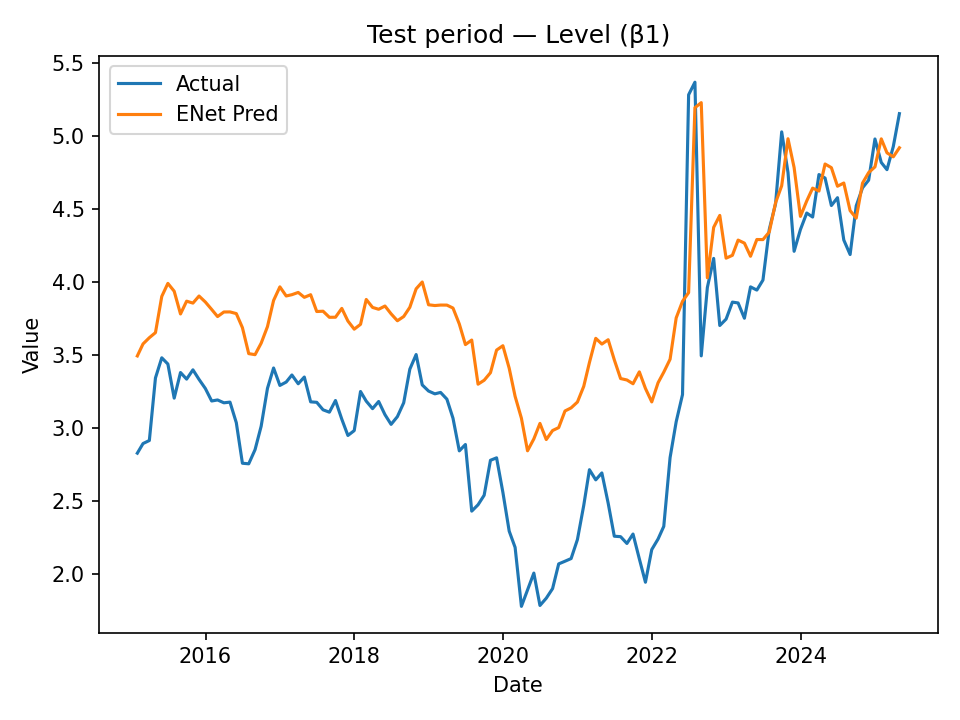
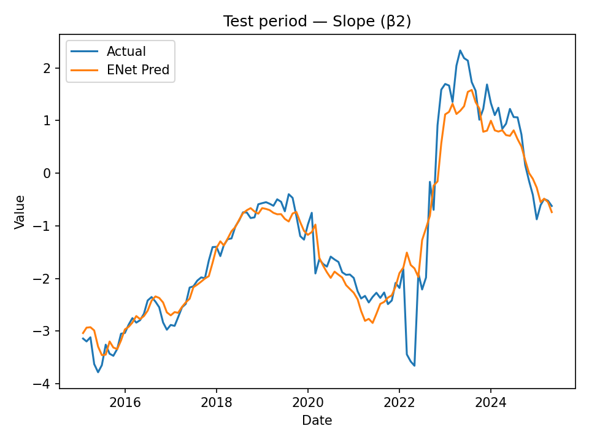
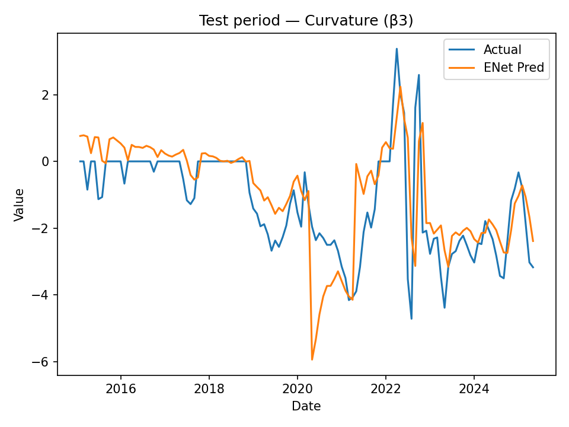
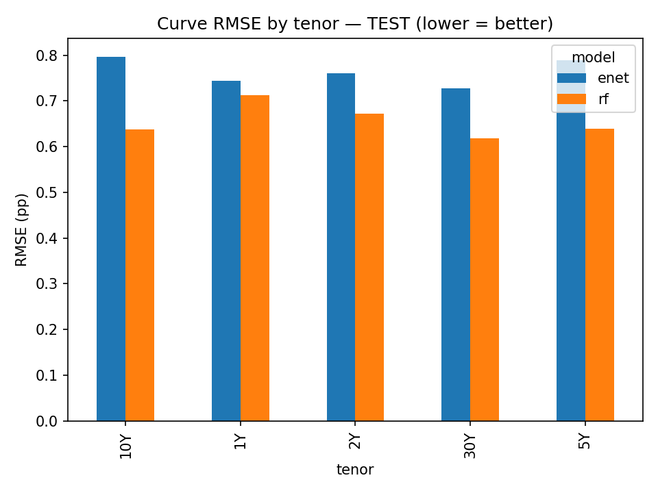
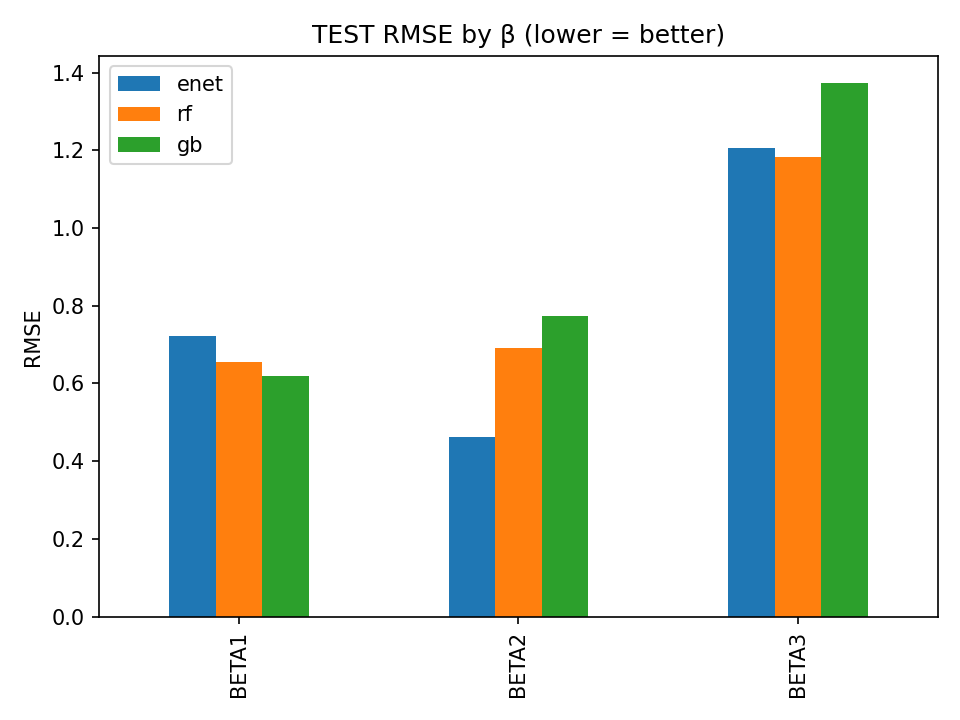

# Yield Curve Forecasting (FRED: 2003–2025)

This is my end-to-end project to forecast the U.S. Treasury yield curve with
**Nelson–Siegel factors** + **supervised models** (AR/VAR/Elastic Net/Random Forest/Gradient Boosting),
using **only public FRED data**. Monthly frequency, 2003-01 to 2025-06.

# Roadmap:
1) Load my Fred CSV files and estimate **β₁ (level), β₂ (slope), β₃ (curvature)** and **τ** each month (robust NS fit).
2) Build features (lags of β’s + macro + spreads) to predict **next-month β’s**.
3) Train/tune **supervised models** with a realistic expanding window:
   - Train: 2003–2009  •  Val: 2010–2014  •  Test: 2015–2025
4) Compare models in **factor space** (errors on β’s) and **yield space** (errors on reconstructed yields).

# Quick start: 
```powershell (VScode)
cd "path to project folder on your own pc"
 1) Create/activate venv
python -m venv .venv
.\.venv\Scripts\Activate.ps1
2) Install deps
python -m pip install --upgrade pip
3) Run the pipeline (my script)
python .\yieldcurve_fc.py

# Results:







